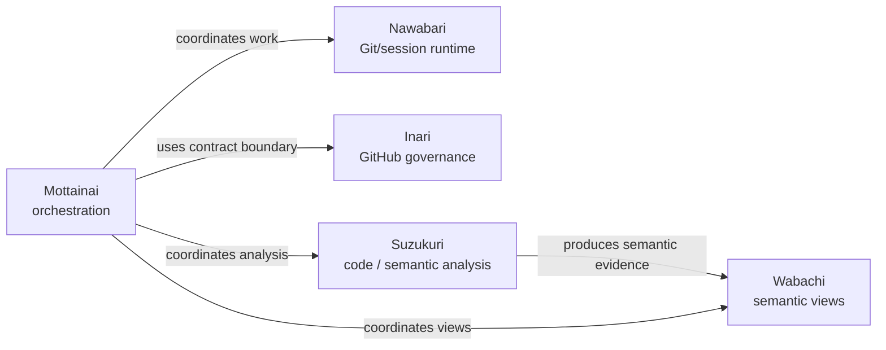

# yohn-jp

The yohn-jp organization builds a governed coding-work system. Its products
separate orchestration, Git and session ownership, GitHub governance, semantic
views, and code analysis.

## Products

### [Mottainai](https://github.com/yohn-jp/mottainai)

Agent orchestration and bounded context runtime for governed coding work.
Mottainai owns task orchestration, semantic policy, context projection, and MCP
routing; physical Git, worktree, and session ownership remains with Nawabari.

### [Nawabari](https://github.com/yohn-jp/nawabari)

Git and session runtime for parallel coding agents. Nawabari owns worktrees,
branches, sessions, and resource claims; it does not own task policy or GitHub
Issue/PR governance.

### [Inari](https://github.com/yohn-jp/gh-inari)

Governance CLI for deterministic GitHub Issue and PR contracts. Inari owns
contract validation, rendering, and governed Issue/PR mutations from
repository-native templates; it does not own local Git or worktree execution.

### [Suzukuri](https://github.com/yohn-jp/suzukuri)

Deterministic, bounded engine for code and semantic analysis. Suzukuri owns the
explicit adapter, semantic-contract, view, and renderer pipeline; callers own
source lifetime, view selection, and orchestration.

### [Wabachi](https://github.com/yohn-jp/wabachi)

Provenance-preserving semantic authority and evaluation views. Wabachi owns
evidence, observations, derived semantic findings, and provider-evaluation
projections; canonical declarations change only through explicit admission, not
through regeneration.

## Portfolio relationships

## Organization dashboard

Dashboard URL: TODO — add the stable GitHub Pages URL when available. The
read-only organization work dashboard is tracked in
[Issue #64](https://github.com/yohn-jp/.github/issues/64).
